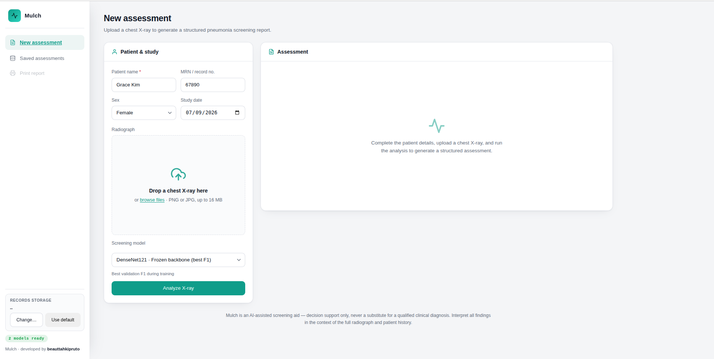
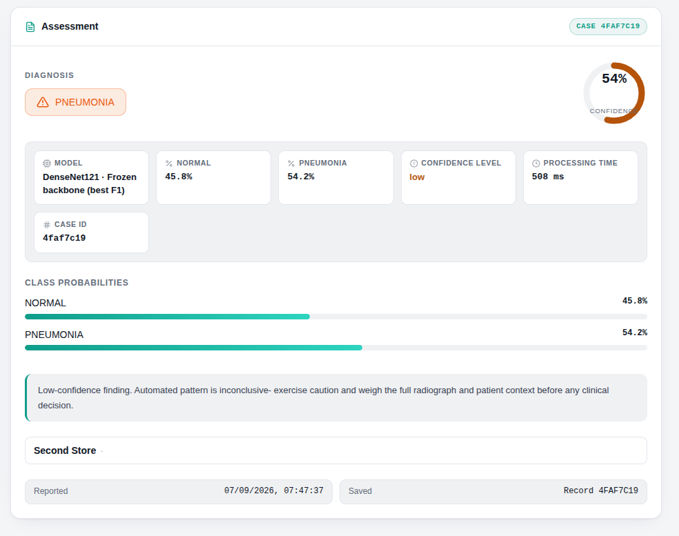
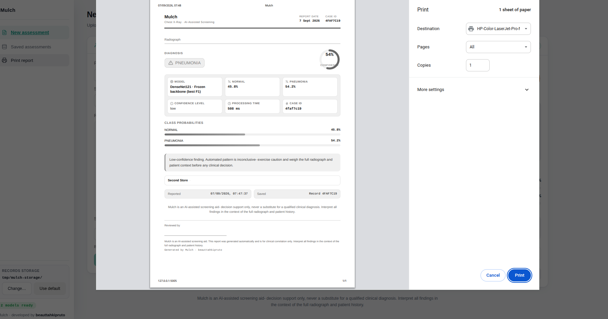

# Mulch

[](https://opensource.org/licenses/MIT)
[]()

Mulch is a self-contained clinical decision-support app for AI-assisted chest X-ray pneumonia
screening. It runs a DenseNet121 classifier locally, highlights suspicious regions with Grad-CAM
attention heatmaps, and saves every assessment with patient details and structured diagnosis
outputs. All inference runs on-device; no patient data leaves the machine.





---

## Prerequisites

The system requires the following runtime environments and dependencies:
- Python (3.10 or higher)
- pip and venv (bundled with CPython on most platforms)
- A Linux, macOS, or Windows workstation (CPU-only build)

---

## Installation and Setup

1. Clone the repository to your local system:
   ```bash
   git clone https://github.com/kiprutobeauttah/mulch.git
   cd mulch
   ```

2. Create a virtual environment and install the dependencies:
   ```bash
   python3 -m venv .venv
   .venv/bin/pip install --index-url https://download.pytorch.org/whl/cpu torch torchvision
   .venv/bin/pip install -r requirements.txt
   ```
   Alternatively, run `./run.sh`, which performs the setup above and launches the app.

---

## Usage

To execute the application in local development mode, run:

```bash
./run.sh
```

The local server runs by default at `http://127.0.0.1:5005` and opens your browser
automatically. Configuration is available through environment variables:

| Variable         | Default       | Description                          |
| ---------------- | ------------- | ------------------------------------ |
| `MULCH_PORT`     | `5005`        | HTTP port the server listens on      |
| `MULCH_DATA_DIR` | `~/.mulch`    | Directory for saved records and images |

For a standalone desktop release, build the bundle with PyInstaller:

```bash
.venv/bin/python -m pip install pyinstaller
.venv/bin/python -m PyInstaller --noconfirm Mulch.spec
```

---

## License

This software is distributed under the MIT License. Refer to the `LICENSE` file for the complete terms and conditions.